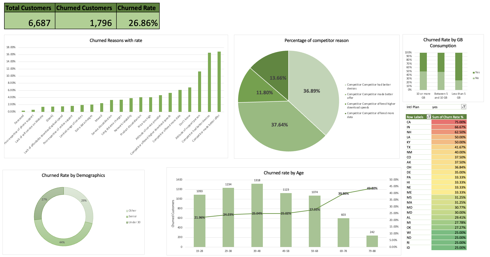

# 📊 Databel Telecom - Customer Churn Analysis

This project analyzes customer churn for **Databel**, a fictional telecom company, using Excel. The main goal is to understand why customers leave and how to reduce churn through calculated metrics, pivot tables, and a visual dashboard.

---

## 🎯 Objective

- Calculate churn rate and identify at-risk segments
- Analyze key drivers of churn
- Visualize trends through an Excel dashboard
- Provide actionable insights and recommendations

---

## 📁 Project Files

- `Project.xlsx`: Main Excel workbook with analysis and dashboard
- `Dashboard.png`: Dashboard image for quick reference
- `Dictionary.md`: Data dictionary describing each column
- `KPI.md`: Key performance indicators and formulas used
- `README.md`: Project summary and structure

---

## 🖼️ Dashboard Preview

---

## 📌 Key Insights

- **Churn Rate:** 26.86% (1,796 out of 6,687 customers)
- **Main Reasons for Churn:**
  - Competitor made a better offer
  - Better devices or prices offered by competitors
- **Heavy data users churn more**, especially without international plans
- **Older and younger segments** have higher churn rates compared to mid-age customers
- **California and Indiana** show the highest churn rates despite international plans

More detailed analysis is available in [`KPI.md`](KPI.md).

---

## 📈 Tools Used

- Microsoft Excel
  - Calculated Columns
  - PivotTables
  - Slicers & Filters
  - Dashboard creation

---

## 📎 Credits

This fictional dataset and case study are for learning and portfolio purposes.

